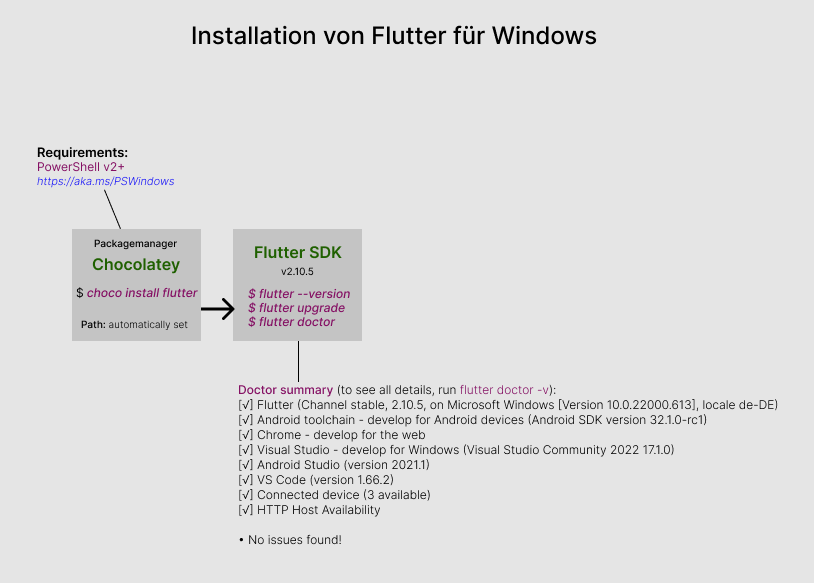

## Set Up 

### Minimum System Requirements

- Operating Systems: Windows 7 SP1 or later (64-bit)
- Disk Space: At least 400 MB.
- Tools: Flutter depends on these tools being available in your environment.
- Windows PowerShell 5.0 or newer (this is pre-installed with Windows 10)
- Git For Windows

### Installing Chocolatey

?> On windows, the easiest way to install Flutter is via the package manager <strong>Chocolatey</strong>.

<p>With PowerShell, you must ensure Get-ExecutionPolicy is not Restricted.</br>
Run the following command in Windows Powershell</p>

```
C:\>Set-ExecutionPolicy Bypass -Scope Process -Force; [System.Net.ServicePointManager]::SecurityProtocol = [System.Net.ServicePointManager]::SecurityProtocol -bor 3072; iex ((New-Object System.Net.WebClient).DownloadString('https://community.chocolatey.org/install.ps1'))
```

<p>Paste the copied text into your shell and press Enter.</br>
If you don't see any errors, you are ready to use Chocolatey!</p>

> C:\>choco

<i>Chocolatey v1.1.0</i>  
<i>Please run 'choco -?' or 'choco <command> -?' for help menu.</i>

With Chocolatey on your machine, you simply have to run:

<div align=center>

</div>

```
C:\> choco install flutter
```
