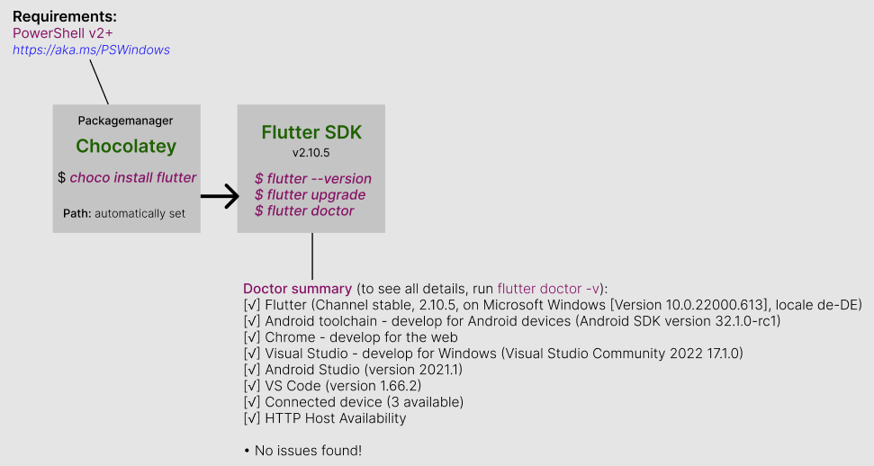
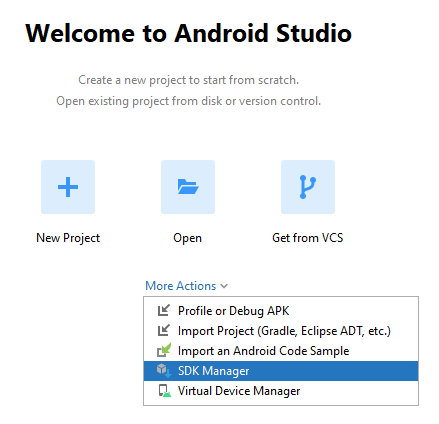
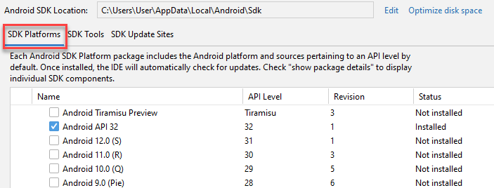
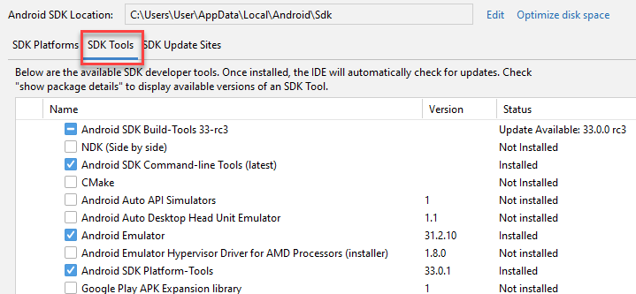
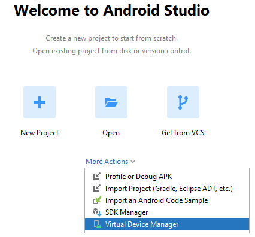
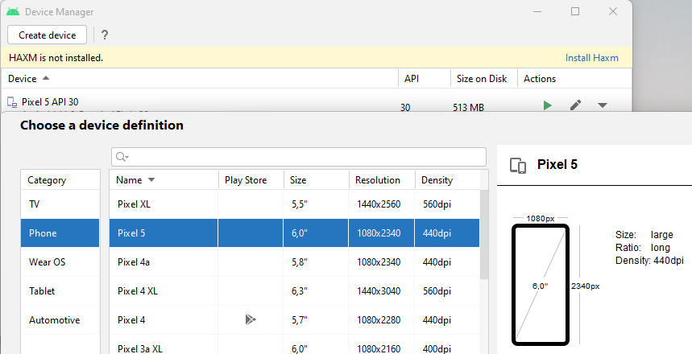

## Set-Up 

?> What’s Flutter?  

<p>Developed by Google, Flutter is a mobile app SDK, which allows developers to develop high-quality native interfaces for iOS, Android, Web, macOS, and Linux devices using a single codebase. It allows developers to write a code once and use it on different software devices.</p> 

Flutter is a free and open-source framework. The amazing features of Flutter enhance the mobile app development experiences.

Therefore, Flutter is the best choice for every startup.


### Minimum Requirements

- Operating Systems: Windows 7 SP1 or later (64-bit)
- Disk Space: At least 400 MB.
- Tools: Flutter depends on these tools being available in your environment.
- Windows PowerShell 5.0 or newer (this is pre-installed with Windows 10)
- Git For Windows

### Installing Chocolatey

?> On windows, the easiest way to install Flutter is via the package manager <strong>Chocolatey</strong>.   

> **Step 1:** `Open the Start Menu`    
Click the *Windows* Key. This opens the Start Menu  

> **Step 2:** `Find Powershell`  
Type *PowerShell* into the Search Field.  
PowerShell should appear at the top of the menu.  

> **Step 3:** `Open Powershell as an Administrator`  
Right-click on the Powershell icon. A context menu will appear. 

Select *Run as Administrator* and say yes to changes to your PC. 

You'll see the message:  
*PowerShell 7.2.2  
Copyright (c) Microsoft Corporation.  
https://aka.ms/powershell  
Type 'help' to get help.*   

> **Step 4:** `Set the execution Policy`
The command instructs PowerShell to let you run scripts for this session. 
Once you close the PowerShell window, it will default back to the original execution policy.</p>


<p>With PowerShell, you must ensure Get-ExecutionPolicy is not Restricted.</br>
Run the following command in Windows Powershell - Installation is included</p>

```
C:\>Set-ExecutionPolicy Bypass -Scope Process -Force; [System.Net.ServicePointManager]::SecurityProtocol = [System.Net.ServicePointManager]::SecurityProtocol -bor 3072; iex ((New-Object System.Net.WebClient).DownloadString('https://community.chocolatey.org/install.ps1'))
```

<p>If you don't see any errors, you are ready to use Chocolatey!</p>
Verify Chocolatey  

> C:\> **choco --version**

<pre><i>Chocolatey v1.1.0    
Please run 'choco -?' or 'choco <command> -?' for help menu.</i></pre></br> 

> C:\> **choco list -l**
PS C:\Users\User> choco list -l
Chocolatey v1.1.0
chocolatey 1.1.0
chocolatey-core.extension 1.3.5.1
chocolatey-dotnetfx.extension 1.0.1
chocolatey-visualstudio.extension 1.10.0
chocolatey-windowsupdate.extension 1.0.4
dotnetfx 4.8.0.20190930
<strong>flutter 2.10.0</strong>
KB2919355 1.0.20160915
KB2919442 1.0.20160915
KB2999226 1.0.20181019
KB3033929 1.0.5
KB3035131 1.0.3

`With Chocolatey on your machine, you simply have to run:`


> C:\> **choco install flutter**

<br>

<div align=center>

</div>
</br>


> C:\> **flutter doctor**  

<p>With the execution of this command, it will check your environment and display the Flutter installation status. Find out the below results for any additional applications you are required to install or further tasks to complement.</p>

    
### Develop for Android Devices  
Download the Android Studio and install it.   

This installs the latest version of  

-  Android SDK, 
-  Android SDK Platform-Tools, 
-  and Android SDK Build-Tools,   
  
  which are essential while developing a Flutter app for the Android system.

### Set Up SDK Manager

Open Android Studio > More Actions> SDK Manager >   

<div align=left>

</div>

Check out you have the latest SDK Platform 

<div align=left>

</div>  

check the neccessary tools  

<div align=left>

</div>  

### Create Virtual Device

Open Android Studio > More Actions> SDK Manager >   

<div align=left>

</div>  

Select a device where you want to simulate your app on...  

<div align=left>

</div>  

If you do a final check and get all ticks  

> C:\> **flutter doctor**  

Doctor summary (to see all details, run flutter doctor -v):
[√] Flutter (Channel stable, 2.10.5, on Microsoft Windows [Version 10.0.22000.613], locale de-DE)
[√] Android toolchain - develop for Android devices (Android SDK version 32.1.0-rc1)
[√] Chrome - develop for the web
[√] Visual Studio - develop for Windows (Visual Studio Community 2022 17.1.0)
[√] Android Studio (version 2021.1)
[√] VS Code (version 1.66.2)
[√] Connected device (3 available)
[√] HTTP Host Availability

• No issues found!


Tadda! Now, you are one step closer to becoming a Flutter developer.  

Good luck in your development journey!
